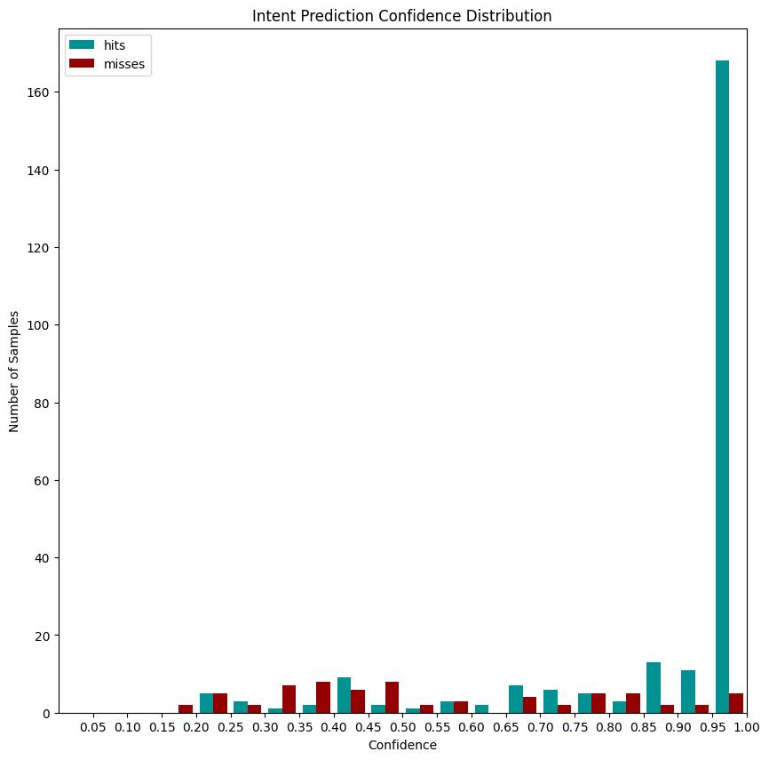
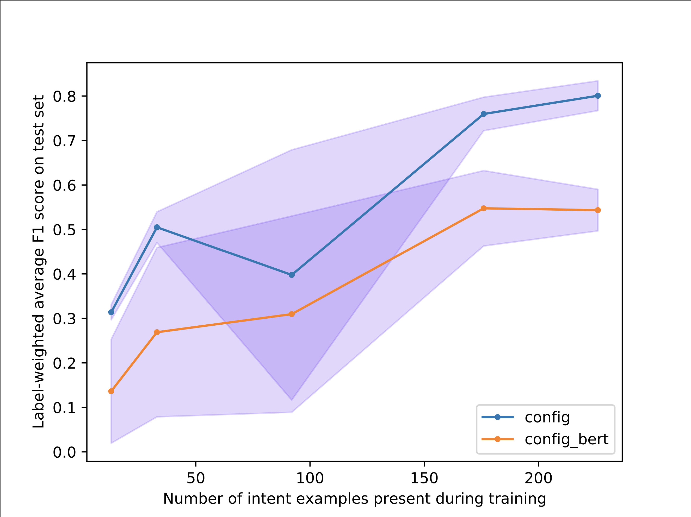

# Rasa 한글 처리를 위한 custom component 개발 튜토리얼

## 사전 작업

### GloVe Featurizer의 사전 임베딩 다운받기

GloVe 의 한글 사전 임베딩은 책 "한국어임베딩"의 github에서 가져왔습니다.

아래에서 다운 받을 수 있습니다. 
[https://drive.google.com/drive/folders/1K_pMeDTOYs2oiBN5g_0pXRH6ar_0RyaJ?usp=sharing](https://drive.google.com/drive/folders/1K_pMeDTOYs2oiBN5g_0pXRH6ar_0RyaJ?usp=sharing){:target="_blank"}

rasa-korean-demo 디렉토리 내에서 glove.txt 파일을 아래 경로에 두어야 합니다.
>./custom/gloVe_featurizer/model/glove.txt

## 학습 데이터 

* AI_hub 대화데이터에서 숙박업 중 호텔 관련 대화 내용을 활용함
    * 그중 예약문의 부분만 스토리는 제가 직접 만들어보았습니다.
* Intent
    * 인텐트 개수: 15
    * 예제: 314개
* Entity
    * 엔티티 개수: 26
    * 예제: 263개

### 파이프라인 구성

1. config.yml

```markdown
language: kr
pipeline:
  - name: "custom.mecab_tokenizer.tokenizer.MecabTokenizer"
  - name: "custom.gloVe_featurizer.dense_featurizer.GloVeFeaturizer"
  - name: RegexFeaturizer
  - name: LexicalSyntacticFeaturizer
  - name: CountVectorsFeaturizer
  - name: CountVectorsFeaturizer
    analyzer: "char_wb"
    min_ngram: 1
    max_ngram: 4
  - name: DIETClassifier
    epochs: 100
  - name: "custom.regexExtractor.regexExtractor.RegexExtractor"
  - name: EntitySynonymMapper
  - name: ResponseSelector
    epochs: 100

policies:
  - name: MemoizationPolicy
  - name: TEDPolicy
    max_history: 5
    epochs: 100
  - name: MappingPolicy
  - name: FallbackPolicy
    nlu_threshold: 0.3
    ambiguity_threshold: 0.1
    core_threshold: 0.11
    fallback_action_name: utter_fallback
  - name: FormPolicy
```

2. config_bert.yml

```markdown

language: kr
pipeline:
  - name: HFTransformersNLP
    model_name: "bert"
    model_weight: "bert-base-multilingual-cased"
  - name: "LanguageModelTokenizer"
  - name: "LanguageModelFeaturizer"
  - name: RegexFeaturizer
  - name: LexicalSyntacticFeaturizer
  - name: CountVectorsFeaturizer
  - name: CountVectorsFeaturizer
    analyzer: "char_wb"
    min_ngram: 1
    max_ngram: 4
  - name: DIETClassifier
    epochs: 100
  - name: EntitySynonymMapper
  - name: "custom.regexExtractor.regexExtractor.RegexExtractor"
  - name: ResponseSelector
    epochs: 100

policies:
  - name: MemoizationPolicy
  - name: TEDPolicy
    max_history: 5
    epochs: 100
  - name: MappingPolicy
  - name: FallbackPolicy
    nlu_threshold: 0.3
    ambiguity_threshold: 0.1
    core_threshold: 0.11
    fallback_action_name: utter_fallback
  - name: FormPolicy

```

## 성능

1. confidence 별 인텐트 예측 결과(config.yml 기준)



2. config.yml vs config_bert.yml

